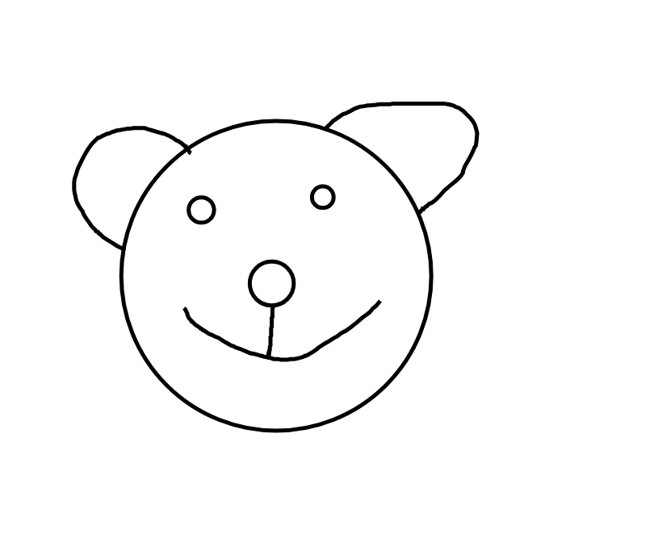
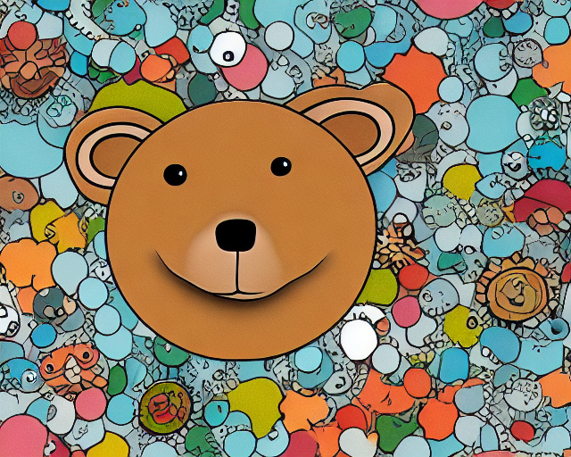

ScribbleDiffusion
---
---

This simple **unofficial** site uses API of Replicate-powered app [scribblediffusion.com](https://scribblediffusion.com/).

---

[scribblediffusion.com](https://scribblediffusion.com/) is powered by:

🚀 [Replicate](https://replicate.com/jagilley/controlnet-scribble), a platform for running machine learning models in the cloud.

🖍️ [ControlNet](https://github.com/replicate/controlnet), an open-source machine learning model that generates images from text and scribbles.

---
**Usage:**
* Clone the repo.
* Edit `settings.py` file with `os.environ["REPLICATE_API_TOKEN"] = "<your_token>"` to `./config` folder.
* Open the root folder of the repository.
* Run `pip install -r requirements.txt` to install required packages.
* Run `python manage.py runserver`.

---

